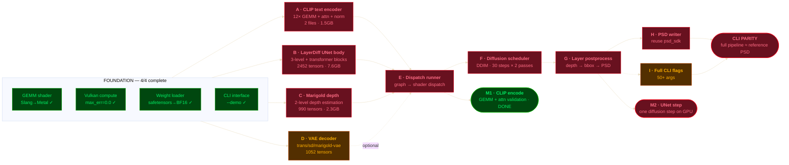

# CLI Parity — Critical Path (PERT)

Mermaid flowchart source for the CLI-parity critical path. Renders natively on
GitHub. Colors chosen in OKHSL (perceptually uniform): every role shares the
same lightness (fill L=0.34, border L=0.60, text L=0.82) and differs only by
hue — green=done, red=critical path, blue=pending, amber=optional.

